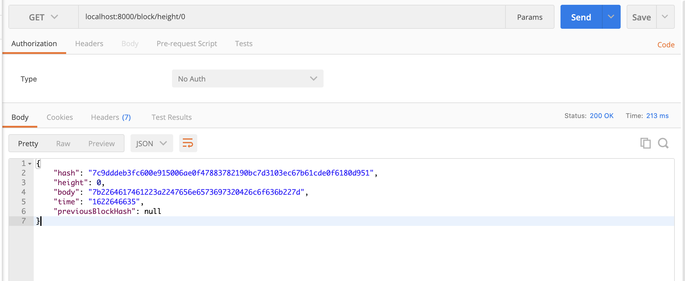
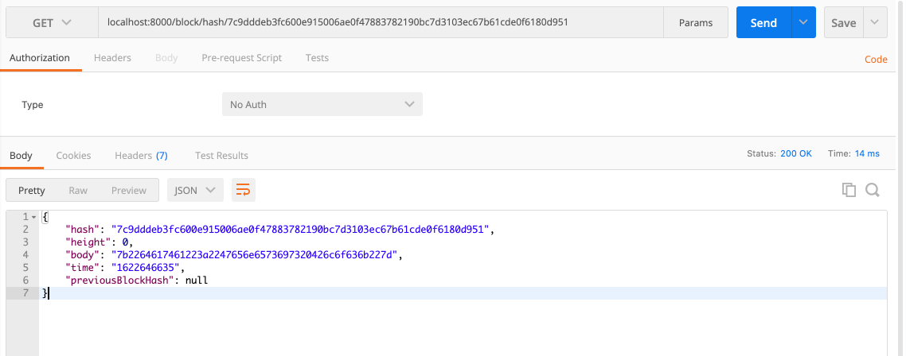
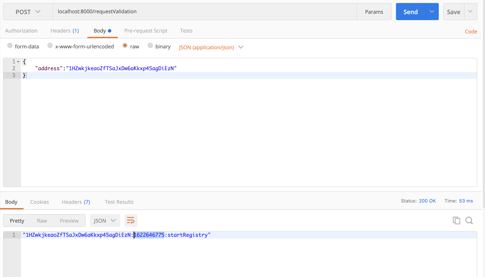
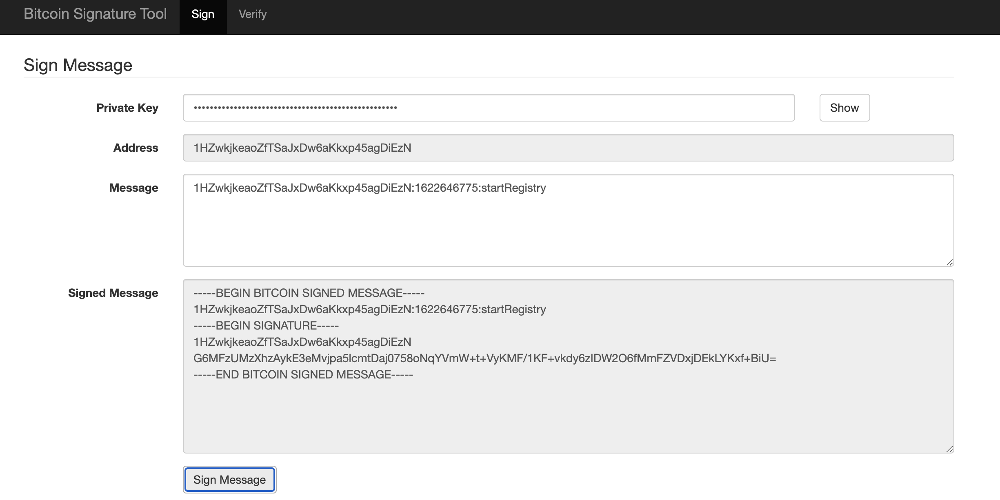
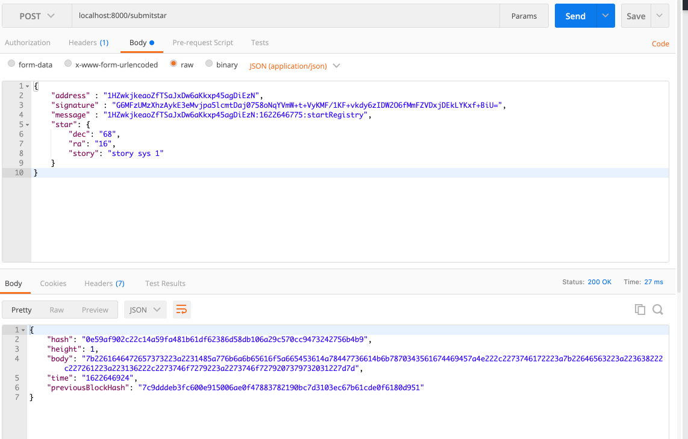
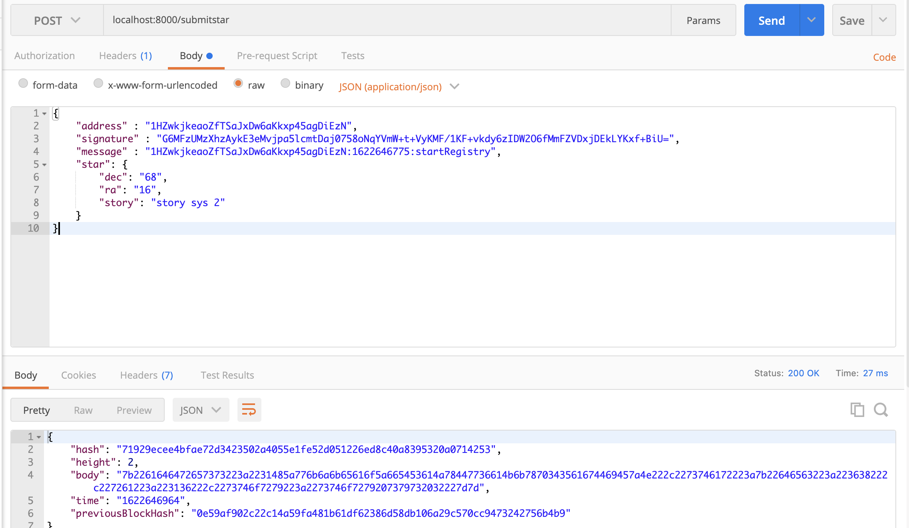
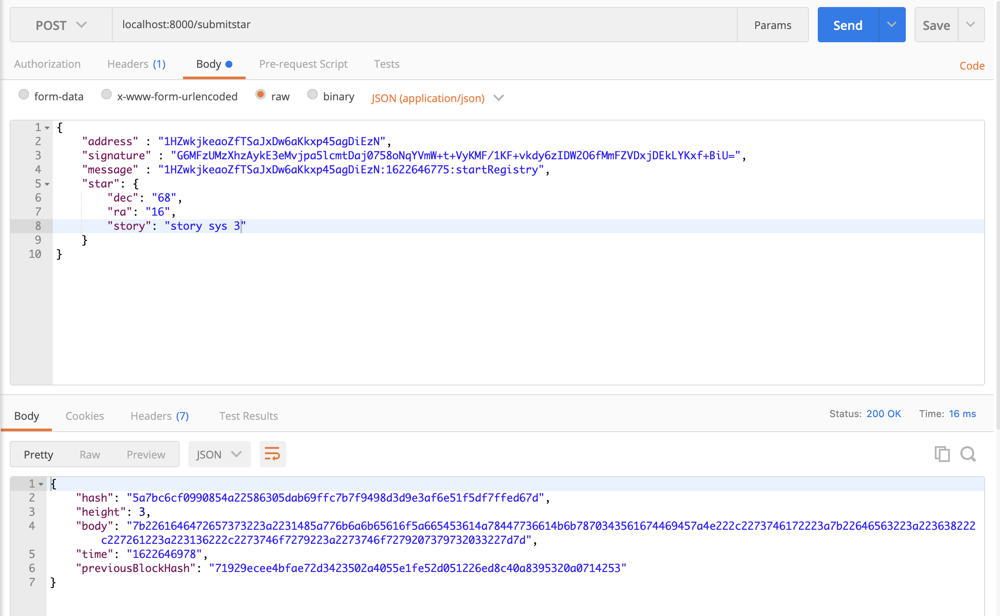
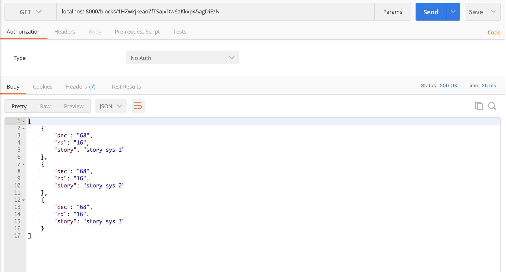

# Private Blockchain Application

I use [Bitcoin Signature Tool](https://reinproject.org/bitcoin-signature-tool) to sign the message.

## Test your App functionality

Use 'POSTMAN' or similar service to test your blockchains endpoints and send screenshots of each call
- must use a GET call to request the Genesis block

- must use a POST call to requestValidation

- must sign message with your wallet

- must submit your Star

- must use GET call to retrieve starts owned by a particular address

